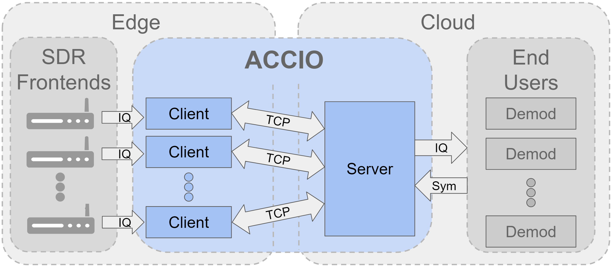

# ACCIO: CRAN Architecture for LoRa

# CloudLoRa:

The Cloud Radio Access Network (CRAN) architecture has been proposed as a way of addressing the network throughput and scalability challenges of large-scale LoRa networks. CRANs can improve network throughput by coherently combining signals, and scale to multiple channels by implementing the receivers in the cloud. However, in remote LoRa deployments, a CRAN’s demand for high-backhaul bandwidths can be challenging to meet. Therefore, bandwidth-aware compression of LoRa samples is needed to reap the benefits of CRANs. We introduce Cloud-LoRa, the first practical CRAN for LoRa, that can detect sub-noise LoRa signals and perform bandwidth-adaptive compression. To the best of our knowledge, this is the first demonstration of CRAN for LoRa operating in real-time. We deploy Cloud-LoRa in an agricultural field over multiple days with USRP as the gateway. A cellular backhaul hotspot is then used to stream the compressed samples to a Microsoft Azure server. We demonstrate SNR gains of over 6 dB using joint multi-gateway decoding and over 2x throughput improvement using state-of-the-art receivers, enabled by CRAN in real-world deployments.

# Installation and setup

# Client

Import the Github repo onto Client laptop. The client side comprises of a software defined radio (e.g. USRP B200) acting as a gateway connected to a laptop. GNU-Radio 3.10.x.x is required to stream real time raw I/Q samples from USRP. Load the sketch GNU_Flow/8Chan.grc and set the sample rate to 2MHz in order to capture 8 channels (assuming 8 LoRa nodes have been deployed in the field, each transmitting at 125kHz bandwidth using a random SF(7,8,9)).
Nodes 1-8: [902.5e6, 902.7e6, 902.9e6, 903.1e6, 903.3, 903.5, 903.7e6, 903.9e6] MHz 
and set the USRP center frequency (903.2 MHz) such that it is the center of 1-8 LoRa transmitters.  This sketch performs channelization and opens 8 sockets, where it dumps I/Q samples of each channel.

Install python3 and all the requirements in Requirements.txt. Open Client/client_config.py and set the CENTER_FREQ to 903.2MHz. Once the azure server is setup, update the SERVER_IP with relevant IP address (assuming server has been setup and running). Following this run Client/main.py. This script will connect to 8 GNU-Radio sockets. Upon start up it will record and update the noise floor and thresholds for each channel. It starts receiving the I/Q samples for each channel, initiates threads and processes for each channel to detect channel activity and upon detecting channel activity, it runs RL to come up with appropriate level of compression depending on received signal strength and available network Bandwidth between client and server (to measure bandwidth and round-trip time, we use TCP-BBR at client) and other state variables. It then compresses the active sessions and sends the compressed sessions as tcp packets to the server at the specified IP address.

# Server

In order to run server on cloud, the users will have to create a machine e.g. an azure machine (in order to run cloudLoRa in real time, a higher core (8) machine is preferred so that it can handle as many channels as possible). Once a cloud machine is created (note down key and IP), users can SSH into the cloud machine from client laptop through the key and IP address. Once into the cloud server, pull CloudLoRa’s github repo and download python3, docker, docker-compose and install Server_reqs.txt. Run following commands

-> sudo docker-compose build

-> sudo docker-compose up

-> less docker-compose.yml

Then run Server/server2.py. It should create a connection with the client and will start decompressing the incoming sessions and decoding them. All the information will be logged in Server/DATA_LOG.txt.

Also, in Server/server_config.py, set the LoRa packet parameters appropriately.

# End_User

If users wish to use other demodulators (CIC & FTrack), they may access it at End_User/Demodulators. Plus, End_User has End_User_config file that has a parameter MAX_DATA_SYM which puts a limit to maximum length of packet to be decoded by std_LoRa decoder. If users wish to increase this limit, they will have to change this parameter in End_User_config and Server/server_config.py.

Users will first setup cloud server, use its IP address to initiate Client/main.py. Once client is running and is connected to Cloud server, run GNU-Radio to stream samples.

